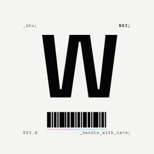

<p align="center">
  
</p>

<h1 align="center">Wren</h1>

<p align="center">
  A native desktop music player built with Kotlin and Compose Desktop.<br/>
  Searches and streams audio from YouTube Music and YouTube — no ads, login optional.
</p>

<p align="center">
  <a href="https://github.com/Nxssie/wren/actions/workflows/gradle-ci.yml"></a>
  <a href="LICENSE"></a>
  
  
</p>

## Features

- Search songs across YouTube Music and YouTube simultaneously, results interleaved and sortable by popularity, duration, or source
- Artist pages with top songs, albums, singles, and EPs
- Queue playback with automatic prefetching of upcoming tracks
- Google OAuth login to access your YouTube Music playlists and library
- Popularity-based artist sorting using monthly listener counts parsed directly from the YTMusic API
- Now Playing screen with synced/plain lyrics (from [lrclib.net](https://lrclib.net)) and resizable queue panel
- Dark/light theme toggle in the sidebar
- Persistent player bar with seek, volume, and queue controls
- Stream URL resolution via `yt-dlp` (bundled in AppImage, or available in PATH)
- 4-hour stream URL cache to avoid redundant requests

## Stack

- **UI**: [Compose Desktop](https://www.jetbrains.com/compose-multiplatform/) (Jetpack Compose for JVM)
- **Language**: Kotlin
- **Player**: [JavaCV](https://github.com/bytedeco/javacv) + FFmpeg (in-process audio decoding and playback)
- **Stream resolution**: `yt-dlp` (for reliable YouTube stream URL extraction)
- **Concurrency**: Kotlin coroutines (`async`/`coroutineScope` for parallel API calls)
- **Serialization**: `kotlinx.serialization`
- **Auth**: OAuth 2.0 with PKCE (S256) local redirect, implemented from scratch without third-party auth libraries

## Architecture

Wren is split into Gradle modules: `desktop` is the shipping Linux app today, `shared` holds
domain models reused by future targets, and `android` is an early, unfinished scaffold.

```
shared/src/commonMain/kotlin/
└── models/
    └── Models.kt             # Domain models (SearchResult, QueueItem, Playlist, ...)

desktop/src/main/kotlin/
├── api/
│   ├── YoutubeMusic.kt       # Public facade — search, artist lookup
│   ├── YtMusicSearch.kt      # InnerTube search parsing (songs + artists)
│   ├── YtMusicArtist.kt      # Artist page + album track parsing
│   ├── YtMusicPlaylists.kt   # YouTube Data API v3 (playlists, view counts)
│   ├── YtMusicStream.kt      # Stream URL resolution + cache
│   ├── YtSearch.kt           # YouTube (non-Music) video search
│   ├── Lyrics.kt             # Synced/plain lyrics from lrclib.net
│   └── ApiKeyManager.kt      # API key management with config file fallback
├── auth/
│   ├── AuthManager.kt        # Token lifecycle, yt-dlp cache sync
│   └── OAuthFlow.kt          # Auth URL, local redirect server, token exchange
├── player/
│   └── FFmpegPlayer.kt       # in-process FFmpeg decoder + Java Sound API playback
├── ui/
│   ├── App.kt                # Window, sidebar, navigation
│   ├── SearchScreen.kt       # Search UI, sort dropdown, artist rows
│   ├── ArtistScreen.kt       # Artist page UI
│   ├── LibraryScreen.kt      # Playlist library
│   ├── NowPlayingScreen.kt   # Now Playing with lyrics + queue
│   ├── PlayerBar.kt          # Persistent playback controls
│   └── AuthDialog.kt         # OAuth login dialog
└── util/
    └── Log.kt                # File logger (~/.local/state/wren/wren.log) for diagnostics
```

## Requirements

- JDK 21
- `yt-dlp` available in PATH (bundled in AppImage, or install via `sudo apt install yt-dlp`)
- No external media player required — FFmpeg is bundled as a JAR dependency via JavaCV

## Build

```bash
# Copy and configure the Gradle properties
cp gradle.properties.example gradle.properties
# Edit gradle.properties if you need to point to a specific JDK

./gradlew :desktop:run
```

### AppImage

```bash
./build-appimage.sh
./Wren.AppImage
```

### Deb / RPM

```bash
./gradlew :desktop:packageDeb
./gradlew :desktop:packageRpm
```

## Authentication (optional)

Wren works without a Google account — search and playback are fully available without login.

Logging in unlocks:
- Your YouTube Music playlists and library
- View count data for popularity sorting

To enable login, create an OAuth 2.0 client ID in the [Google Cloud Console](https://console.cloud.google.com/) (Desktop app type, YouTube Data API v3 scope) and place the downloaded `client_secret_*.json` at:

```
~/.config/wren/oauth.json
```

Tokens are stored at `~/.config/wren/tokens.json` and refreshed automatically.

### API Keys (optional)

Wren ships with default API keys for YouTube Search and InnerTube. To use your own keys, create `~/.config/wren/api.json`:

```json
{
  "youtubeApiKey": "YOUR_YOUTUBE_DATA_API_KEY",
  "innerTubeApiKey": "YOUR_INNERTUBE_KEY"
}
```

Keys in this file override the built-in defaults.

## Notes

This project uses YouTube's internal InnerTube API, which is not publicly documented or officially supported for third-party use. It may break without notice if YouTube changes their API structure. No content is redistributed — the app streams directly from YouTube's CDN.
